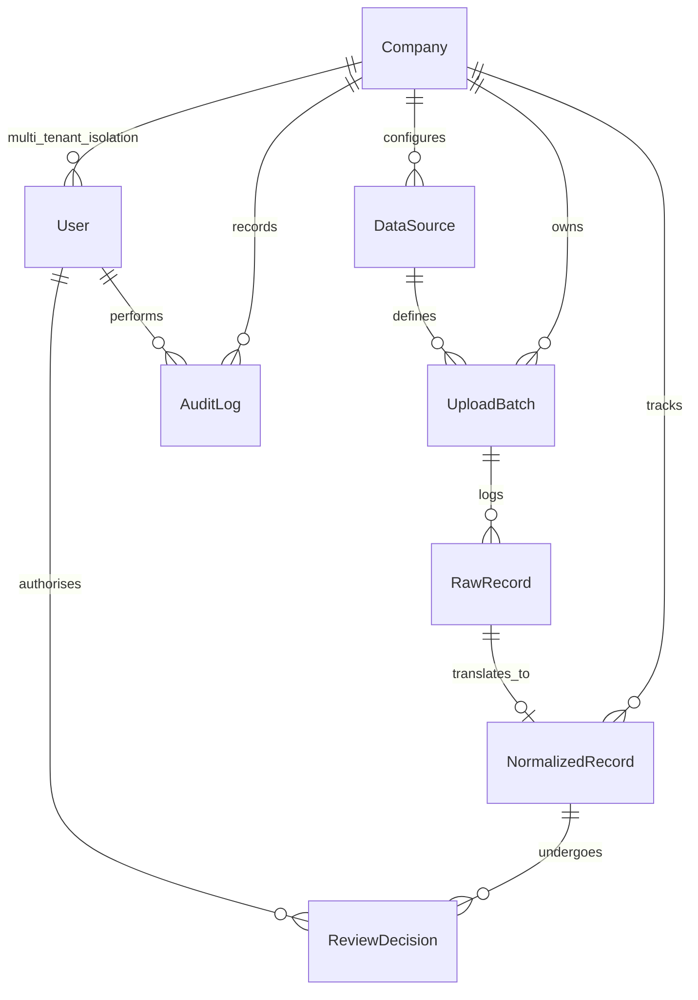

# ESG Platform Data Model Documentation

This document explains the relational data model designed for the SaaS ESG Data Ingestion and Audit Workflow Platform, justifying our architectural choices.

---

## 1. Schema Diagram

Below is the entity-relationship representation of our database schema. It shows how heterogeneous raw inputs trace directly through to immutable, locked, and audited records.



---

## 2. Entity Details

### 2.1 Company (Tenant)
Underpins our multi-tenant SaaS architecture. All data (users, files, records, audit trails) are isolated at the database level by a foreign key back to the `Company`.
- `id` (int, Primary Key)
- `name` (varchar(255), Unique)
- `created_at` (datetime)
- `updated_at` (datetime)

### 2.2 User (Staff & Analyst Profiles)
Extensions of Django's default auth system. Defines authorization and role permissions for individual clients.
- `id` (int, Primary key)
- `username`, `email`, `password`
- `company` (ForeignKey to Company) - scopes what client tenancy the analyst represents.
- `role` (varchar(50)): `analyst` or `manager` or `auditor`.

### 2.3 DataSource (Ingestion Profiles)
Allows dynamic customization of how files are processed for a company.
- `id` (int, Primary Key)
- `company` (ForeignKey to Company)
- `name` (varchar(255))
- `source_type` (varchar(50)): `SAP_CSV`, `UTILITY_CSV`, or `TRAVEL_API`.
- `config` (JSONField): stores specific rules like column names, plant-to-location mappings, tariff multipliers, etc.

### 2.4 UploadBatch (File Trackers)
Represents a singular execution of data ingestion (e.g. an analyst uploading a utility billing CSV).
- `id` (int, Primary Key)
- `company` (ForeignKey to Company)
- `data_source` (ForeignKey to DataSource)
- `file_name` (varchar(255))
- `uploaded_by` (ForeignKey to User)
- `status` (varchar(50)): `pending`, `processing`, `completed`, `failed`.
- `summary` (JSONField): tracks metadata like row counts, flagged row counts, and errors.
- `created_at` (datetime)

### 2.5 RawRecord (Original Payload Preservation)
The "source of truth". To meet strict audit requirements, the original row or payload from the client is saved exactly as received.
- `id` (int, Primary Key)
- `upload_batch` (ForeignKey to UploadBatch)
- `row_index` (int): index of the row inside the CSV/JSON payload.
- `payload` (JSONField): complete raw data payload as key-value pairs (e.g., German column headers, raw strings).
- `status` (varchar(50)): `pending`, `normalized`, or `failed`.
- `error_message` (text, Nullable)

### 2.6 NormalizedRecord (Standardized ESG Activity)
The standardized target model representing normalized greenhouse gas activity data.
- `id` (int, Primary Key)
- `company` (ForeignKey to Company)
- `raw_record` (ForeignKey/OneToOne to RawRecord) - maintains complete traceability back to the source.
- `upload_batch` (ForeignKey to UploadBatch)
- `source_type` (varchar(50))
- `scope_category` (varchar(20)): `Scope 1` (direct mobile/stationary combustion), `Scope 2` (purchased electricity), or `Scope 3` (business travel).
- `activity_type` (varchar(100)): e.g. `fuel_combustion`, `electricity_consumption`, `business_travel`.
- `activity_date` (date): normalized date of occurrence.
- `quantity` (decimal(18, 4)): original raw quantity.
- `unit` (varchar(50)): original unit of measure.
- `normalized_quantity` (decimal(18, 4)): converted quantity in unified units.
- `normalized_unit` (varchar(50)): standardized unit (e.g., `L` for liquid fuels, `kWh` for electricity, `km` for travel distance).
- `status` (varchar(50)): `pending`, `flagged`, `approved`, `rejected`, `locked`.
- `validation_flags` (JSONField): list of data flags (e.g., `["negative_quantity", "invalid_billing_period"]`).
- `locked_at` (datetime, Nullable)
- `locked_by` (ForeignKey to User, Nullable)
- `created_at` (datetime)
- `updated_at` (datetime)

### 2.7 ReviewDecision (Workflow Triggers)
Tracks who approved/rejected/flagged a record and why, providing a detailed record for external auditors.
- `id` (int, Primary Key)
- `normalized_record` (ForeignKey to NormalizedRecord)
- `user` (ForeignKey to User)
- `decision` (varchar(50)): `approved`, `rejected`, `flagged`.
- `comment` (text)
- `created_at` (datetime)

### 2.8 AuditLog (Immutability & Traceability Engine)
An append-only historical log of all database mutations. Ensures that if an analyst manually corrects a normalized record, the auditor can see the exact *before* and *after* values.
- `id` (int, Primary Key)
- `company` (ForeignKey to Company)
- `user` (ForeignKey to User)
- `action` (varchar(100)): `upload_created`, `normalization_completed`, `field_edited`, `record_approved`, `record_rejected`, `record_locked`.
- `target_model` (varchar(100)): name of the modified model (e.g., `NormalizedRecord`).
- `target_id` (varchar(100)): ID of the modified row.
- `old_value` (JSONField, Nullable)
- `new_value` (JSONField, Nullable)
- `timestamp` (datetime)

---

## 3. Justification of Architectural Choices

### 3.1 Multi-Tenancy Architecture
We chose a **shared-database, shared-schema, row-level tenant-isolation model** (using the `company_id` filter). This fits an early-stage SaaS architecture because:
- Minimizes cost and operational overhead of running multiple databases.
- We implement strict scoping on the Django model level (custom managers in Django that automatically filter queries based on the authenticated user's `company_id`).

### 3.2 Dual Storage: Raw vs. Normalized
Maintaining both `RawRecord` and `NormalizedRecord` is an **audit-absolute requirement**.
- **The Raw Record** is immutable. It preserves the messy reality (e.g., a row containing `Menge = "1.200,50"`, `Einheit = "LIT"`).
- **The Normalized Record** maps this to standard columns (`normalized_quantity = 1200.50`, `normalized_unit = "L"`).
- Auditors can compare the two records side-by-side to verify that the normalization code hasn't skewed or altered the baseline data.

### 3.3 Fine-Grained Audit Logs
Unlike basic logging, our `AuditLog` model logs changes in a structured **diff schema** using JSON (`old_value` and `new_value`). If an analyst updates the normalized quantity of a diesel purchase from `100.00 L` to `1000.00 L`, the audit trail captures:
```json
{
  "field": "normalized_quantity",
  "old": 100.00,
  "new": 1000.00
}
```
This is essential for demonstrating data governance to external verifiers.

### 3.4 Lock Status Immutability
Once a record's batch is "Approved" and "Locked":
- Application-level hooks in model save/delete methods block updates.
- Analysts can no longer correct the record unless an admin explicitly unlocks it (which triggers another audit log entry).
